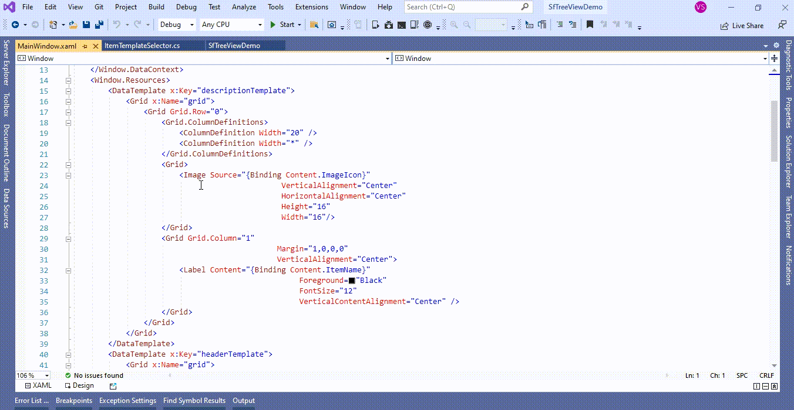

# How to change the icon of a node when expanding in WPF TreeView (SfTreeView)?

## About the sample
This example illustrates how to change the icon of a node when expanding in [WPF TreeView](https://www.syncfusion.com/wpf-controls/treeview) (SfTreeView)?

[WPF TreeView](https://www.syncfusion.com/wpf-controls/treeview) (SfTreeView) does not provide the direct support to change the icon of a node while expanding. You can change the icon of a node while expanding by using [ItemTemplateSelector](https://help.syncfusion.com/cr/wpf/Syncfusion.UI.Xaml.TreeView.SfTreeView.html#Syncfusion_UI_Xaml_TreeView_SfTreeView_ItemTemplateSelector) in [WPF TreeView](https://www.syncfusion.com/wpf-controls/treeview) (SfTreeView). The [WPF TreeView](https://www.syncfusion.com/wpf-controls/treeview) (SfTreeView) allows you to customize the appearance of each item with different templates based on specific constraints by using the [ItemTemplateSelector](https://help.syncfusion.com/cr/wpf/Syncfusion.UI.Xaml.TreeView.SfTreeView.html#Syncfusion_UI_Xaml_TreeView_SfTreeView_ItemTemplateSelector). You can choose a **DataTemplate** for each item at runtime based on the value of data-bound property using [ItemTemplateSelector](https://help.syncfusion.com/cr/wpf/Syncfusion.UI.Xaml.TreeView.SfTreeView.html#Syncfusion_UI_Xaml_TreeView_SfTreeView_ItemTemplateSelector).


```XML

<Window.Resources>
        <DataTemplate x:Key="descriptionTemplate">
            <Grid x:Name="grid">
                <Grid Grid.Row="0">
                    <Grid.ColumnDefinitions>
                        <ColumnDefinition Width="20" />
                        <ColumnDefinition Width="*" />
                    </Grid.ColumnDefinitions>
                    <Grid>
                        <Image Source="{Binding Content.ImageIcon}"
                                               VerticalAlignment="Center"
                                               HorizontalAlignment="Center"
                                               Height="16"
                                               Width="16"/>
                    </Grid>
                    <Grid Grid.Column="1"
                                              Margin="1,0,0,0"
                                              VerticalAlignment="Center">
                        <Label Content="{Binding Content.ItemName}"
                                                   Foreground="Black"
                                                   FontSize="12"
                                                   VerticalContentAlignment="Center" />
                    </Grid>
                </Grid>
            </Grid>
        </DataTemplate>
        <DataTemplate x:Key="headerTemplate">
            <Grid x:Name="grid">
                <Grid Grid.Row="0">
                    <Grid.ColumnDefinitions>
                        <ColumnDefinition Width="20" />
                        <ColumnDefinition Width="*" />
                    </Grid.ColumnDefinitions>
                    <Grid>
                        <!--by defalut show the icon for content-->
                        <Image Source="{Binding Content.ImageIcon}"
                                               VerticalAlignment="Center"
                                               HorizontalAlignment="Center"
                                               Height="16"
                                               Width="16"/>
                    </Grid>
                    <Grid Grid.Column="1"
                                              Margin="1,0,0,0"
                                              VerticalAlignment="Center">
                        <Label Content="{Binding Content.ItemName}"
                                                   Foreground="Teal"
                                                   FontSize="12"
                                                   VerticalContentAlignment="Center" />
                    </Grid>
                </Grid>
            </Grid>
        </DataTemplate>
        <DataTemplate x:Key="headerTemplate1">
            <Grid x:Name="grid">
                <Grid Grid.Row="0">
                    <Grid.ColumnDefinitions>
                        <ColumnDefinition Width="20" />
                        <ColumnDefinition Width="*" />
                    </Grid.ColumnDefinitions>
                    <Grid>
                        <!--While expanding node. In this case added the Icon for CloseFolder in template-->
                        <Image Source="pack://application:,,,/SfTreeViewDemo;component/Icons/treeview_folderClose.png"
                                               VerticalAlignment="Center"
                                               HorizontalAlignment="Center"
                                               Height="16"
                                               Width="16"/>
                    </Grid>
                    <Grid Grid.Column="1"
                                              Margin="1,0,0,0"
                                              VerticalAlignment="Center">
                        <Label Content="{Binding Content.ItemName}"
                                                   Foreground="Teal"
                                                   FontSize="12"
                                                   VerticalContentAlignment="Center" />
                    </Grid>
                </Grid>
            </Grid>
        </DataTemplate>
        <local:ItemTemplateSelector x:Key="itemTemplateSelector"/>
 </Window.Resources>

<Grid>
        <syncfusion:SfTreeView x:Name="sfTreeView" 
                               Grid.Row="1"                               
                               AutoExpandMode="RootNodes"                              
                               ChildPropertyName="SubFiles"                              
                               ItemsSource="{Binding ImageNodeInfo}" 
                               ItemTemplateSelector="{StaticResource itemTemplateSelector}" 
                               ItemTemplateDataContextType="Node" >
        </syncfusion:SfTreeView>
 </Grid>

```

```C#

class ItemTemplateSelector : DataTemplateSelector
{
    public override DataTemplate SelectTemplate(object item, DependencyObject container)
    {
         var treeviewNode = item as TreeViewNode;
         if (treeviewNode == null)
             return null;

         //Check the conditionn for Node expande or Collapsed 
         if (treeviewNode.IsExpanded)
         {
             DataTemplate dataTemplate = ((FrameworkElement)container).FindResource("headerTemplate") as DataTemplate;
             //while Node expanded state added the FolderOpen Icon in below mentioed temaplate
             return dataTemplate;
         }
         else
         {
             DataTemplate dataTemplate = ((FrameworkElement)container).FindResource("headerTemplate1") as DataTemplate;
             //while node collapsed state added the FolderClose Icon in below mentioed temaplate
             return dataTemplate;
         }
    }
}

```



The following screenshot shows to change the icon of a node while expanding in [WPF TreeView](https://www.syncfusion.com/wpf-controls/treeview) (SfTreeView),


Take a moment to peruse the [WPF TreeView - Appearance](https://help.syncfusion.com/wpf/treeview/appearance) documentation, where you can find about appearance with code examples.

## Requirements to run the demo
Visual Studio 2015 and above versions
